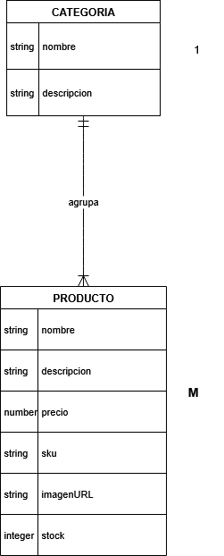
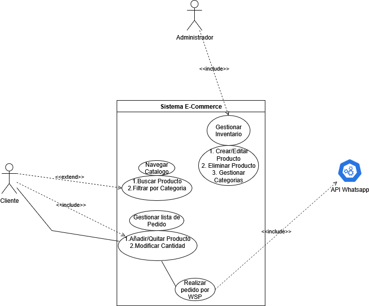
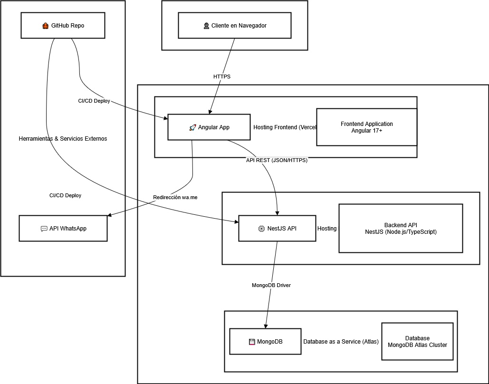

# 🚀 Proyecto E-Commerce para Distribuidora de Productos

> Solución full-stack de e-commerce diseñada como un catálogo digital y canal de pedidos. Este proyecto demuestra una arquitectura moderna y prácticas de desarrollo profesional.

---

## 🧭 Status del Proyecto: FASE 0 - Planificación

El proyecto se encuentra actualmente en la fase de planificación y diseño. La arquitectura y el alcance del MVP han sido definidos.

*   [✅] **Fase 0: Planificación y Diseño Arquitectónico**
*   [⏳] **Fase 1: Preparación del Entorno y Backend (API)**
*   [⬜️] **Fase 2: Desarrollo del Frontend (Cliente)**
*   [⬜️] **Fase 3: Desarrollo del Frontend (Administrador)**
*   [⬜️] **Fase 4: Despliegue y Pruebas**

---

## 🛠️ Arsenal Tecnológico (Tech Stack)

| Componente      | Tecnología                                     |
| --------------- | ---------------------------------------------- |
| **Frontend**    | 🅰️ Angular 17+                                 |
| **Backend (API)** | 🐈 NestJS (Node.js + TypeScript)               |
| **Base de Datos** | 🍃 MongoDB (alojada en MongoDB Atlas)        |
| **Hosting**     | 🚀 Vercel (Frontend) & Render.com (Backend)    |
| **CI/CD**       | 🤖 GitHub Actions (implícito en Vercel/Render) |

---

## 🎯 Objetivos del MVP (Producto Mínimo Viable)

El objetivo principal es entregar un canal de ventas funcional y eficiente basado en el siguiente flujo de usuario:

1.  **Navegación del Catálogo:** El cliente puede explorar, buscar y filtrar productos por categoría.
2.  **Creación de Lista de Pedido:** El cliente puede añadir productos a una "lista de pedido" (un carrito de cotización).
3.  **Checkout Simplificado:** El cliente finaliza su pedido generando un mensaje pre-formateado para ser enviado vía WhatsApp.

---

## 🗺️ Blueprints Arquitectónicos

*   **A continuación se presentan los diagramas que definen la estructura y el comportamiento del sistema.**

### Modelo de Datos Conceptual

### Diagrama de Caso de Uso

### Diagrama de Arquitectura

